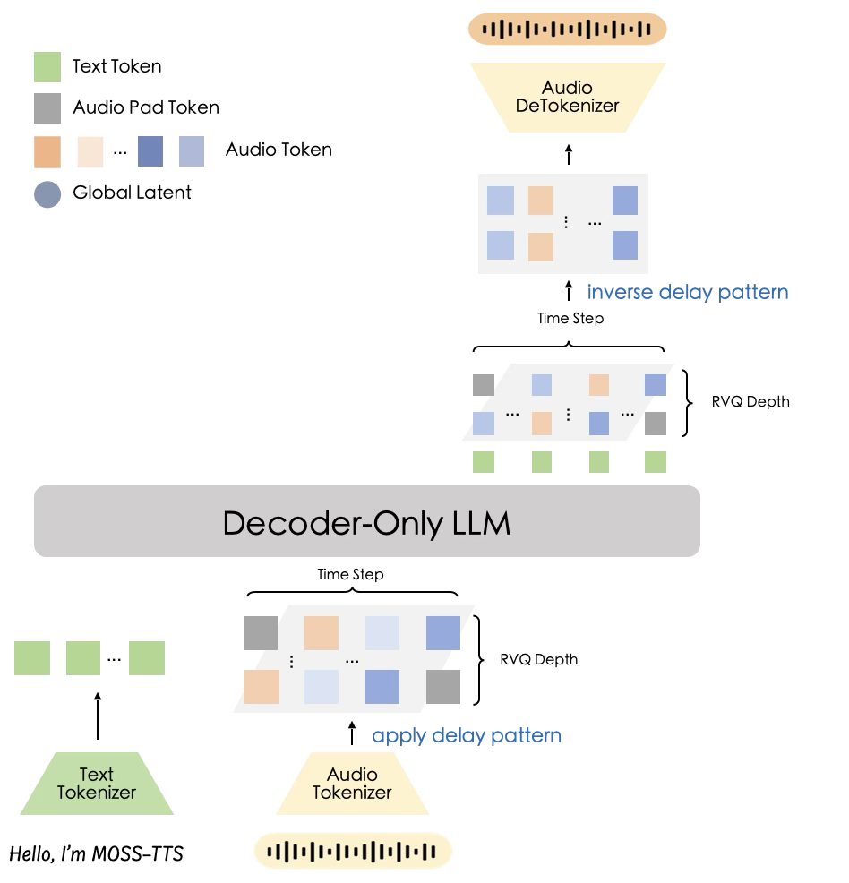

# Architecture: Global Transformer + Delay-Pattern (MossTTSDelay)

This document details the **MossTTSDelay** architecture, the production-grade variant of the MOSS-TTS family. It employs a **Single Transformer** backbone with **Multi-Head Parallel Prediction** and a **Delay-Pattern** scheduling mechanism to achieve high-speed, stable, and long-form speech synthesis. The architecture diagram is shown in the figure.

  

---

## 1. Overview: Parallel Heads + Delay Pattern

Unlike the **MossTTSLocal** architecture which uses a hierarchical "Temporal + Depth" approach, **MossTTSDelay** integrates all modeling into a single large-scale Transformer. It achieves efficient multi-codebook modeling by shifting the RVQ layers in the time domain, allowing the model to predict all codebook layers for a given step simultaneously through multiple linear heads.

### Key Components
*   **Unified Transformer Backbone:** A large-scale language model (based on the **Qwen-8B** scale) that handles text encoding, prosody modeling, and audio token prediction in a single forward pass.
*   **Multi-Head Output Layer:** The backbone is equipped with **$1 + N_q$** (where $N_q=32$) prediction heads. One head manages the primary sequence logic, while the other 32 heads parallelly predict the RVQ codebook layers.
*   **Delay-Pattern Scheduling:** A specialized data formatting technique that introduces a 1-step offset between successive RVQ layers. This enables causal dependency modeling across codebook depths without requiring an additional "Depth Transformer."

---

## 2. Technical Specifications

| Feature | Specification |
| :--- | :--- |
| **Backbone Model** | Initialized from **Qwen-8B** scale |
| **Prediction Heads** | **33 LM Heads** (1 Main + 32 RVQ Heads) |
| **Audio Tokenizer** | **Cat** (Causal Audio Tokenizer) |
| **Sampling Rate** | 24,000 Hz |
| **Frame Rate** | 12.5 Hz (1s ≈ 12.5 tokens) |
| **Codebooks** | 32 RVQ layers (10-bit each) |
| **Generation Mode** | Parallel Autoregressive (Delay-Pattern) |
| **Primary Advantage** | Inference speed & Long-context stability |

---

## 3. Core Mechanism: Multi-Head Parallel Prediction

The defining characteristic of MossTTSDelay is its **computational efficiency**. By attaching 32 independent linear heads to the final hidden state of the Transformer backbone, the model can generate an entire frame's worth of multi-layer RVQ tokens in a **single forward step**.

### Why this is faster than MossTTSLocal:
*   **No Nested Loops:** While the Local architecture requires a secondary "Local Transformer" to iterate through each RVQ layer within one time step, MossTTSDelay computes all layers in parallel.
*   **Direct Projection:** The relationship between codebook layers is captured by the backbone's internal representations and the delay-pattern, removing the latency overhead of a dedicated depth-modeling module.

---

## 4. Prediction Topology: Delay-Pattern

To maintain the hierarchical dependency of RVQ (where Layer $k$ should ideally "see" the information from Layer $k-1$), MossTTSDelay uses **Delay-Pattern Scheduling**. 

**The Pattern:**
At each training or inference step $t$, the input sequence is structured such that:
*   Head 1 predicts Layer 1 of Frame $t$.
*   Head 2 predicts Layer 2 of Frame $t-1$.
*   Head 3 predicts Layer 3 of Frame $t-2$.
*   ... and so on.

**Dependency Modeling:**
Because the Transformer is causal, when the model predicts tokens for "Step $t$", it has already seen the tokens from "Step $t-1$" in its context. Due to the 1-step shift, the information for Layer $k-1$ (at Step $t$) is already present in the history when the model predicts Layer $k$ (at Step $t+1$). This "diagonal" dependency effectively models the coarse-to-fine structure of the audio tokenizer.

---

## 5. Evaluation & Performance

According to the `moss_tts_model_card.md`, the **MossTTSDelay-8B** is the recommended model for production and long-form stability:

| Metric | Result (Seed-TTS-Eval) |
| :--- | :--- |
| **EN SIM (Speaker Similarity)** | **0.7146** |
| **ZH SIM (Speaker Similarity)** | **0.7705** |
| **EN WER (Word Error Rate)** | **1.79%** |
| **ZH CER (Char Error Rate)** | **1.32%** |

**Conclusion:** MossTTSDelay offers superior long-context stability and faster inference speeds compared to the Local variant. Its 8B parameter scale provides the capacity needed for complex prosody and ultra-long (up to 1 hour) speech generation.

---

## 6. Architecture Comparison

| Aspect | MossTTSDelay (Architecture A) | MossTTSLocal (Architecture B) |
| :--- | :--- | :--- |
| **Structure** | Single Transformer (8B) | Temporal + Depth Transformers (1.7B) |
| **Scheduling** | **Delay-Pattern (Diagonal Shift)** | Per-step Synchronous Blocks |
| **Prediction Heads** | **33 Parallel Heads** | Single Latent Head + Local Module |
| **Inference Speed** | **High** (Parallel RVQ prediction) | Moderate (Sequential RVQ prediction) |
| **Stability** | Excellent for long-form (1h+) | Optimized for short-segment metrics |
| **Best For** | Production, Scalable Apps, Narration | Research, Quality Benchmarks |

---